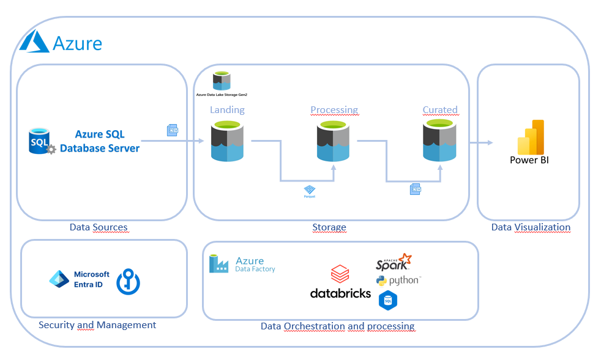

# Data Engineering Pipeline on Azure


## Project Overview

This project demonstrates a complete data engineering pipeline developed on Microsoft Azure. The pipeline includes data extraction from a SQL Server database, data processing and storage using Azure Data Factory, DataLake Gen2, and Databricks, and data visualization with Power BI. The entire project was completed using the Azure Free Tier, costing 22,10 USD.

## Dataset

### Brazilian E-Commerce Public Dataset by Olist

- **Source:** [Kaggle Dataset](https://www.kaggle.com/datasets/olistbr/brazilian-ecommerce?resource=download)
- **Description:** This dataset contains information on 100k orders made at the Olist Store from 2016 to 2018. It includes data on order status, price, payment and freight performance, customer location, product attributes, and customer reviews. The data is anonymized, and references to companies and partners have been replaced with names from Game of Thrones.


## Architecture



1. **Data Extraction**
   - **Source:** SQL Server database
   - **Tool:** Azure Data Factory

2. **Data Processing and Storage**
   - **Initial Storage:** CSV files stored in the Landing layer of DataLake Gen2
   - **Processing:** Databricks notebook
     - **Stages:** 
       - Landing to Processing
       - Processing to Curated

3. **Data Visualization**
   - **Tool:** Power BI
   - **Connection:** DataLake Gen2

## Detailed Steps

### 1. Resource Group and SQL Server Setup

- **Resource Group:** Created a Resource Group in Azure.
- **SQL Server and Database:** Set up a SQL Server and a database using default configurations.
- **SQL Server Management Studio (SSMS):** Connected to Azure SQL Server using SSMS and imported data from the Kaggle dataset to create tables in the database.

### 2. Data Storage in DataLake Gen2

- **Data Lake Setup:** Configured Azure Data Lake Gen2 with containers for data storage.
- **Landing Process Executor:** Created Landing, Processing and Curated containers.

### 3. Data Processing with Azure Data Factory

- **Data Pipeline:** Developed a pipeline in Azure Data Factory to transfer data from SQL Server to the Landing layer in DataLake Gen2.
- **Control Flow:** Used `ForEach` activity to process all files in SQL Server.

### 4. Data Processing with Azure Databricks

- **Notebook Development:** Created a notebook in Azure Databricks.
  - **Authentication:** Used Azure Active Directory (Microsoft Entra ID) and Azure Key Vault for secure configuration and app registration.
  - **Data Connection:** Connected to the data using JDBC and stored credentials securely.
  - **Cluster Setup:** Created a logical cluster in Databricks for data processing.
  - **Data Processing:** Processed data from Landing to Processing (in Parquet format) and from Processing to Curated (in CSV format).

### 5. Data Visualization with Power BI

- **Connection:** Connected Power BI to DataLake Gen2 using DirectQuery via JDBC.
- **Reports and Dashboards:** Created interactive reports and dashboards for data visualization.

### 6. Orchestration and Scheduling

- **Data Factory Integration:** Integrated the Databricks notebook into the Azure Data Factory pipeline.
  - **Conditional Execution:** Configured to execute the notebook if the `ForEach` activity completed successfully.
- **Scheduling:** Set up triggers for pipeline orchestration.

### 7. Testing with Azure Synapse

- **Performance Testing:** Ran queries in Azure Synapse to validate data models and performance.


## Additional Configuration

- **Permissions:** Configured necessary permissions for Databricks and DataLake access.
- **Data Vault:** Implemented a Data Vault model to manage data lineage and versioning.
- **Testing:** Conducted tests using Azure Synapse for performance validation.

## Cost and Usage

- **Free Tier:** The project was developed using Azure's Free Tier.
- **Total Cost:** 22,10 USD.

## Conclusion

This project showcases a data engineering pipeline on Azure, demonstrating end-to-end data processing from extraction to visualization. The use of various Azure services like Data Factory, DataLake Gen2, Databricks, and Power BI highlights the integration capabilities within the Azure ecosystem.


## Repository Structure

```plaintext
├──architecture
├── data_processing/
│   ├── notebooks/
│   │   ├── olist_processing.ipynb
├── data_visualization/
│   ├── power_bi_reports/
|   |   ├── dashboard_simples.pbix
|   |   ├── pandas_olist_dashboard.pbix
├── sql_scripts
|       ├── 1_SYNAPSE_SELECT_ORDERS.sql
|       ├── 2_SYNAPSE_SELECT_ORDERS_PER_YEAR.sql
|       ├── 3_SYNAPSE_CREATE_EXTERNAL_DATA_SOURCE.sql
|       ├── 4_SYNAPSE_CREATE_STORED_PROCEDURE.sql
|       ├── 5_SYNAPSE_CLEAN_UP_EXTERNAL_RESOURCES.sql
├── README.md
```

Feel free to explore the repository for detailed configurations, scripts, and reports related to the project.

## Contact

For any questions or further information, please reach out to melojleo@hotmail.com or https://www.linkedin.com/in/melojleo/
